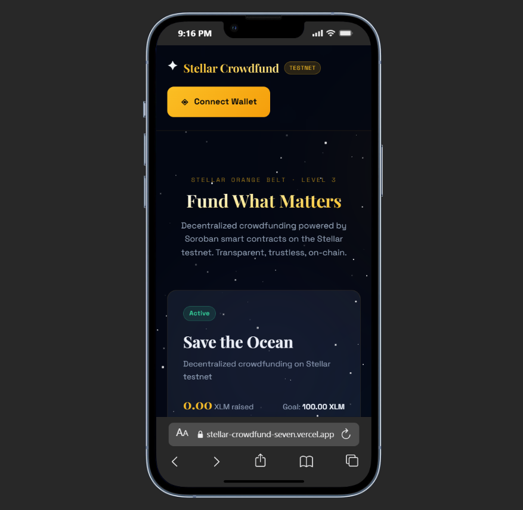
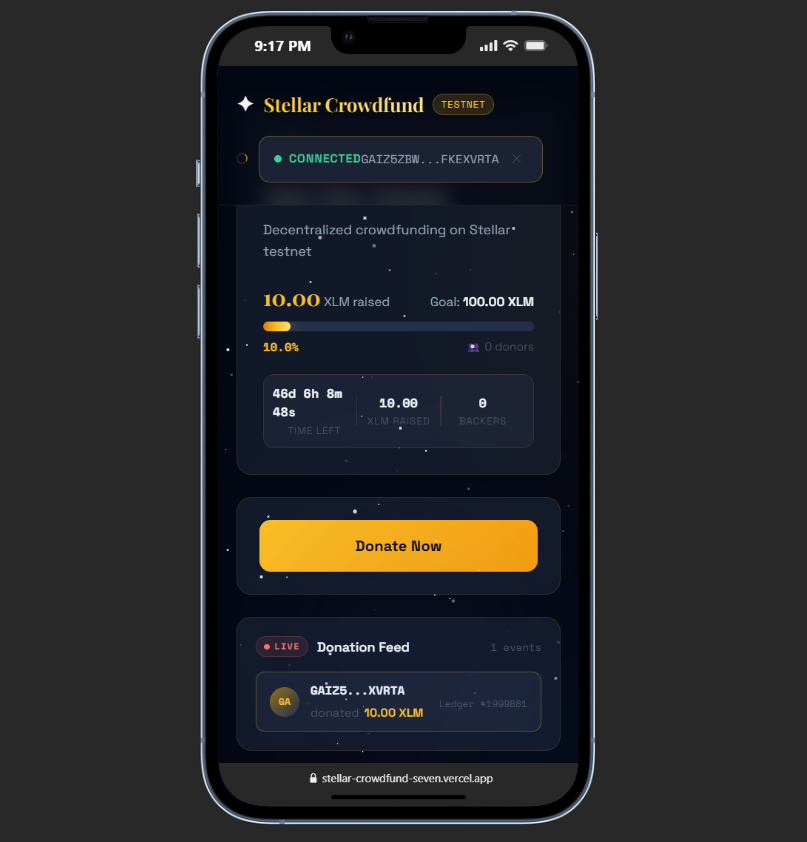
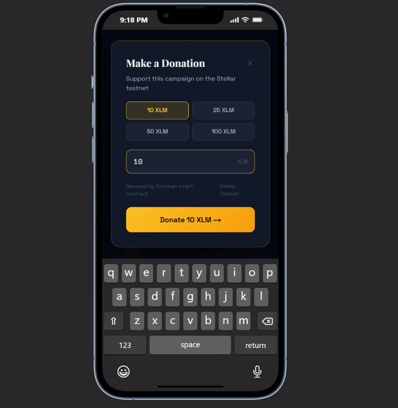
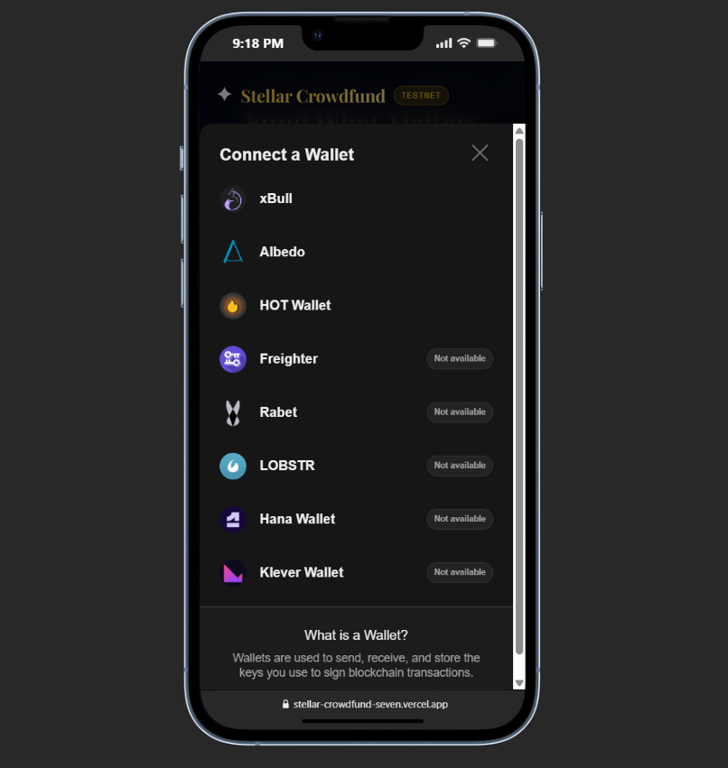
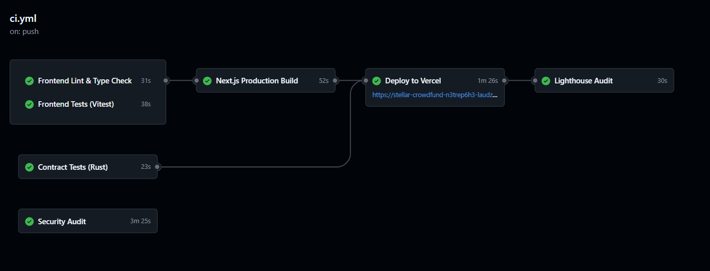
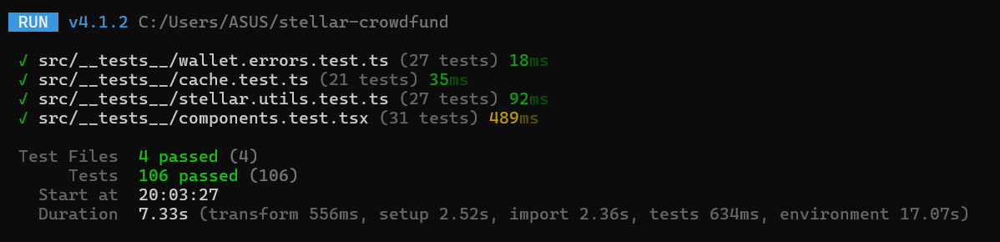

# Stellar Crowdfund

> Decentralized crowdfunding on Stellar Testnet — **Green Belt (Level 4)** submission for the [Stellar Journey to Mastery](https://stellar.org) program.

[](https://stellar.org)
[](https://soroban.stellar.org)
[](https://nextjs.org)
[](https://typescriptlang.org)
[](https://github.com/laudzakusuma/stellar-crowdfund/actions/workflows/ci.yml)

---

## Live Demo

**[https://stellar-crowdfund-seven.vercel.app](https://stellar-crowdfund-seven.vercel.app)**

---

## Demo Video

Click the image below to watch the full demo:

[](https://youtu.be/8IZzT-qInBA)

This video demonstrates the full functionality of the Stellar Crowdfund dApp, including:

- Multi-wallet connection (Freighter, Albedo, xBull, HOT Wallet, etc.)
- Real-time campaign data from Soroban smart contract
- Donation flow with CROWD token rewards via inter-contract call
- Error handling (wallet not found, rejected, insufficient balance)
- Live event updates and progress tracking

---

## Mobile Responsive

Fully responsive on all screen sizes — tested on iPhone 14 (390px).

| Home Screen | Connected + Live Feed | Donate Modal | Wallet Selector |
|:-----------:|:---------------------:|:------------:|:---------------:|
|  |  |  |  |

Key mobile features:
- Full-width responsive layout with Tailwind CSS breakpoints
- Touch-friendly wallet connect and donation flow
- No horizontal scroll on 320px+ devices
- Native keyboard support for donation input
- Adaptive progress bar and campaign stats

---

## CI/CD Pipeline



[](https://github.com/laudzakusuma/stellar-crowdfund/actions/workflows/ci.yml)

Automated 7-job pipeline triggers on every push to `main`:

| # | Job | Description | Status |
|---|---|---|---|
| 1 | Contract Tests (Rust) | `cargo test` for both contracts | ✅ |
| 2 | Frontend Lint & Type Check | `next lint` + `tsc --noEmit` | ✅ |
| 3 | Frontend Tests (Vitest) | 106 tests across 4 test files | ✅ |
| 4 | Next.js Production Build | Full production build | ✅ |
| 5 | Deploy to Vercel | Auto-deploy on main branch | ✅ |
| 6 | Lighthouse Audit | Performance & accessibility audit | ✅ |
| 7 | Security Audit | npm + cargo vulnerability scan | ✅ |

---

## Level 3 — Advanced Contract Patterns

### Inter-Contract Call Architecture

```
Donor (wallet)
    │
    ▼  donate(donor, amount_stroops)
┌─────────────────────────────────┐
│       Crowdfund Contract        │  ← CCTPQORD...CQZR
│  - records donation             │
│  - updates campaign.raised      │
│  - computes reward tokens       │
└────────────┬────────────────────┘
             │
             │  mint(donor, reward_tokens)
             │  ← INTER-CONTRACT CALL
             ▼
┌─────────────────────────────────┐
│     CrowdToken Contract         │  ← CCVHBZKV...HXKN
│  - verifies caller = minter     │
│  - mints CROWD to donor wallet  │
│  - emits mint event             │
└─────────────────────────────────┘
             │
             ▼
    Donor receives CROWD tokens
    Rate: 10 CROWD per 1 XLM donated
```

### Deployed Contracts (Testnet)

| Contract | Address | Explorer |
|---|---|---|
| **Crowdfund** | `CCTPQORDKR2EXUR6BOBTA7UXM7NSPP3MRI7BXSNTOWF5F5KQ2ZALCQZR` | [View ↗](https://stellar.expert/explorer/testnet/contract/CCTPQORDKR2EXUR6BOBTA7UXM7NSPP3MRI7BXSNTOWF5F5KQ2ZALCQZR) |
| **CrowdToken (CROWD)** | `CCVHBZKVJCWOSEG27EXUIUVWK5O72AZJHW34GOW237HJKEZMRMJIAHXN` | [View ↗](https://stellar.expert/explorer/testnet/contract/CCVHBZKVJCWOSEG27EXUIUVWK5O72AZJHW34GOW237HJKEZMRMJIAHXN) |
| **Deployer** | `GAKXVPOXZEM2BFZ7FIISOO2PKQ437QH2TIRBH6A5YCAOQESTQHKGV2MJ` | [View ↗](https://stellar.expert/explorer/testnet/account/GAKXVPOXZEM2BFZ7FIISOO2PKQ437QH2TIRBH6A5YCAOQESTQHKGV2MJ) |

### Key Transactions

| Action | TX Hash | Explorer |
|---|---|---|
| Deploy CrowdToken WASM | `7ef5f804...3a632d` | [View ↗](https://stellar.expert/explorer/testnet/tx/7ef5f804a3477137e002a9549f926703bbe69c2eee6e12c932c1ec41323a632d) |
| Initialize CrowdToken (minter=Crowdfund) | `a2fabaa4...3d9c` | [View ↗](https://stellar.expert/explorer/testnet/tx/a2fabaa4851517e6ca64d1e60c11de868268da9a8f5678e4829c818023423d9c) |
| Initialize Crowdfund (reward_token set) | `2ac74e68...726f` | [View ↗](https://stellar.expert/explorer/testnet/tx/2ac74e686730dacea8c6171fcafd30a4e831fcb7a9afe1a4d3f4516b0299726f) |

### CrowdToken (CROWD)

| Property | Value |
|---|---|
| Symbol | `CROWD` |
| Decimals | `7` |
| Standard | SEP-0041 Token Interface |
| Reward rate | 10 CROWD per 1 XLM donated |
| Minting | Restricted to Crowdfund contract only |
| Total supply | Dynamic — minted on each donation |

### Level 3 Requirements Checklist

| Requirement | Status | Notes |
|---|---|---|
| Inter-contract call working | ✅ | `donate()` → `mint()` cross-contract |
| Custom token deployed | ✅ | CrowdToken (CROWD) on testnet |
| CI/CD running | ✅ | 7-job GitHub Actions pipeline |
| Mobile responsive | ✅ | Tested on iPhone 14, 390px |
| 8+ meaningful commits | ✅ | 35+ commits total |
| Advanced event streaming | ✅ | Real-time events + `reward_minted` |

---

## Screenshots

### Main Interface

> Halaman utama crowdfund dengan tombol Connect Wallet dan status testnet.

### Wallet Options

> Multi-wallet selector — Freighter, Albedo, xBull, HOT Wallet, dan lainnya.

### Campaign Progress

> Real-time fundraising progress bar, backed by Soroban smart contract.

### Test Output

> 106 Tests Passed across 4 test files.

---

## Smart Contract Functions

### Crowdfund Contract

| Function | Type | Description |
|---|---|---|
| `initialize(owner, title, description, goal, deadline, reward_token)` | Write | Initialize campaign (once) |
| `donate(donor, amount)` | Write | Donate XLM + mint CROWD rewards via inter-contract call |
| `withdraw()` | Write | Owner withdraws when goal reached |
| `refund(donor)` | Write | Donor refund after failed campaign |
| `get_campaign()` | Read | Full campaign struct |
| `get_donation(donor)` | Read | Donor's total contribution in stroops |
| `get_progress()` | Read | Progress 0–100 |
| `is_active()` | Read | Boolean: campaign still active? |
| `get_reward_token()` | Read | CrowdToken contract address |
| `preview_reward(amount)` | Read | Preview CROWD tokens earned for amount |

### CrowdToken Contract

| Function | Type | Description |
|---|---|---|
| `initialize(admin, minter, decimal, name, symbol)` | Write | One-time setup, sets Crowdfund as minter |
| `mint(to, amount)` | Write | Mint CROWD — only callable by Crowdfund contract |
| `balance(id)` | Read | Token balance of address |
| `transfer(from, to, amount)` | Write | Transfer CROWD between wallets |
| `burn(from, amount)` | Write | Burn CROWD tokens |
| `total_supply()` | Read | Total CROWD minted |
| `decimals()` | Read | Returns 7 |
| `name()` | Read | Returns "Crowd Token" |
| `symbol()` | Read | Returns "CROWD" |

---

## Error Handling (3 Types)

```typescript
// Error Type 1: Wallet extension not installed
"WALLET_NOT_FOUND" → User sees install links for Freighter / Albedo

// Error Type 2: User clicked Reject in wallet popup
"USER_REJECTED" → Friendly message + option to retry

// Error Type 3: Not enough XLM for transaction + fees
"INSUFFICIENT_BALANCE" → Clear explanation of insufficient funds
```

---

## Quick Start

### 1. Clone & Install

```bash
git clone https://github.com/laudzakusuma/stellar-crowdfund
cd stellar-crowdfund
npm install
```

### 2. Deploy Smart Contracts

```bash
# Install Stellar CLI
cargo install --locked stellar-cli --features opt

# Add wasm target
rustup target add wasm32v1-none

# Build both contracts
stellar contract build

# Deploy CrowdToken
stellar contract deploy \
  --wasm target/wasm32v1-none/release/crowd_token.wasm \
  --source alice \
  --network testnet

# Initialize CrowdToken (minter = crowdfund contract address)
stellar contract invoke \
  --id <CROWD_TOKEN_ID> \
  --source alice \
  --network testnet \
  -- initialize \
  --admin <YOUR_ADDRESS> \
  --minter <CROWDFUND_ID> \
  --decimal 7 \
  --name '"Crowd Token"' \
  --symbol '"CROWD"'

# Deploy Crowdfund
stellar contract deploy \
  --wasm target/wasm32v1-none/release/crowdfund.wasm \
  --source alice \
  --network testnet

# Initialize Crowdfund (with reward_token)
stellar contract invoke \
  --id <CROWDFUND_ID> \
  --source alice \
  --network testnet \
  -- initialize \
  --owner <YOUR_ADDRESS> \
  --title '"Save the Ocean"' \
  --description '"Decentralized crowdfunding on Stellar testnet"' \
  --goal 1000000000 \
  --deadline 1780000000 \
  --reward_token <CROWD_TOKEN_ID>
```

### 3. Configure Environment

```bash
cp .env.example .env.local
```

```env
NEXT_PUBLIC_CROWDFUND_CONTRACT_ID=CCTPQORDKR2EXUR6BOBTA7UXM7NSPP3MRI7BXSNTOWF5F5KQ2ZALCQZR
NEXT_PUBLIC_CROWD_TOKEN_CONTRACT_ID=CCVHBZKVJCWOSEG27EXUIUVWK5O72AZJHW34GOW237HJKEZMRMJIAHXN
NEXT_PUBLIC_STELLAR_NETWORK=TESTNET
NEXT_PUBLIC_SOROBAN_RPC=https://soroban-testnet.stellar.org
NEXT_PUBLIC_NETWORK_PASSPHRASE="Test SDF Network ; September 2015"
```

### 4. Run Locally

```bash
npm run dev
# Open http://localhost:3000
```

### 5. Run Tests

```bash
# Frontend tests (106 tests)
npm test

# Rust contract tests
cargo test -p crowdfund --verbose
cargo test -p crowd-token --verbose
```

---

## Architecture

```
stellar-crowdfund/
├── contracts/
│   ├── crowdfund/
│   │   ├── Cargo.toml              # Soroban contract package
│   │   └── src/lib.rs              # Crowdfund + inter-contract call
│   └── crowd-token/
│       ├── Cargo.toml              # Token contract package
│       └── src/lib.rs              # CrowdToken SEP-0041
├── .github/
│   └── workflows/
│       └── ci.yml                  # 7-job CI/CD pipeline
├── src/
│   ├── app/
│   │   ├── layout.tsx              # Root layout + fonts
│   │   ├── page.tsx                # Main page
│   │   └── globals.css             # Cosmic dark theme
│   ├── components/
│   │   ├── WalletConnect.tsx       # Multi-wallet + error display
│   │   ├── CampaignCard.tsx        # Progress bar + stats
│   │   ├── DonateModal.tsx         # Donation input modal
│   │   ├── TxStatus.tsx            # Transaction status banner
│   │   ├── EventFeed.tsx           # Real-time contract events
│   │   └── RewardBadge.tsx         # CROWD token balance + preview
│   ├── hooks/
│   │   ├── useWallet.ts            # StellarWalletsKit + error handling
│   │   ├── useContract.ts          # Contract read/write + event polling
│   │   └── useToken.ts             # CrowdToken balance polling
│   └── lib/
│       └── stellar.ts              # Utility functions
├── scripts/
│   └── deploy.sh                   # One-command deploy both contracts
├── lighthouse-budget.json          # Lighthouse performance budget
└── README.md
```

---

## Real-Time Features

- **Campaign data** auto-refreshes every **5 seconds** via RPC simulation
- **Contract events** polled every **8 seconds** via `getEvents` API
- **Live donation feed** shows new donations with ledger numbers
- **Transaction status** polls for confirmation after submission
- **CROWD token balance** updates every **10 seconds** after donation

---

## Wallets Supported

| Wallet | Platform |
|---|---|
| Freighter | Browser Extension |
| Albedo | Web-based |
| xBull | Browser Extension |
| Lobstr | Mobile + Web |
| Rabet | Browser Extension |
| HOT Wallet | Mobile |
| Hana Wallet | Browser Extension |

---

## Tech Stack

| Layer | Technology |
|---|---|
| Frontend | Next.js 14, TypeScript, Tailwind CSS |
| Smart Contracts | Rust, Soroban SDK v22 |
| Token Standard | SEP-0041 (CrowdToken) |
| Wallet Integration | `@creit.tech/stellar-wallets-kit` |
| Stellar SDK | `@stellar/stellar-sdk` v12 |
| Testing | Vitest + @testing-library/react |
| CI/CD | GitHub Actions (7 jobs) |
| Deployment | Vercel |
| Fonts | Playfair Display + Space Grotesk + Space Mono |

---

## Ecosystem Fit

Crowdfunding is a natural use case for Stellar:

- **Fast finality** (5 seconds) → donors get instant confirmation
- **Low fees** → micro-donations are viable
- **Global reach** → borderless fundraising without intermediaries
- **Soroban contracts** → trustless, automated fund release
- **Token rewards** → CROWD tokens incentivize early donors and create community ownership

---
