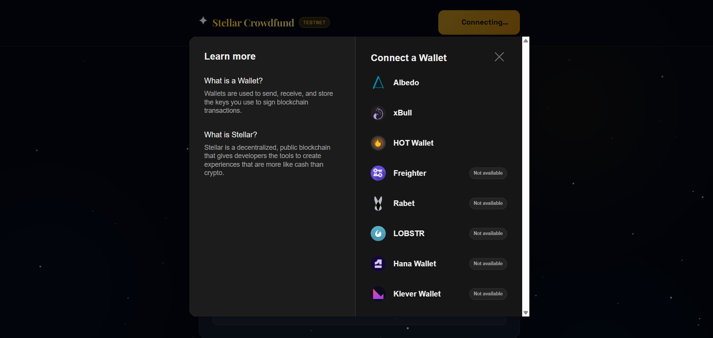
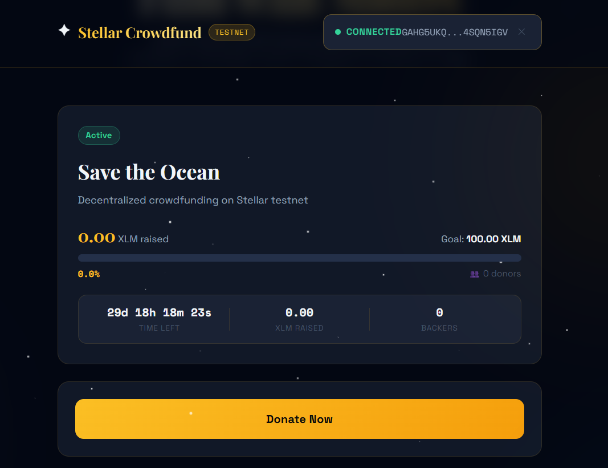
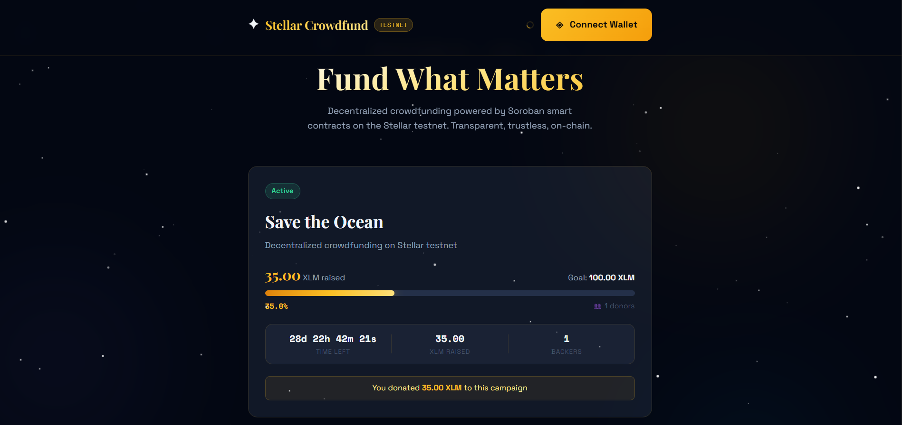

# Stellar Crowdfund

> Decentralized crowdfunding on Stellar Testnet — **Yellow Belt (Level 2)** submission for the [Stellar Journey to Mastery](https://stellar.org) program.

[](https://stellar.org)
[](https://soroban.stellar.org)
[](https://nextjs.org)
[](https://typescriptlang.org)

---

## Live Demo

**→ [https://stellar-crowdfund.vercel.app](https://stellar-crowdfund.vercel.app)** *(deploy to Vercel and update this link)*

---

## Screenshots

### Wallet Connection Options

> Multi-wallet selection modal — Freighter, Albedo, xBull, Lobstr, and more via StellarWalletsKit

### Campaign Progress

> Real-time fundraising progress bar, backed by Soroban smart contract

### Main Interface

> Halaman utama crowdfund dengan tombol Connect Wallet dan status testnet.

### Transaction Status

> Pending → Success → Explorer link flow

---

## Level 2 Requirements Checklist

| Requirement | Status | Notes |
|---|---|---|
| 3 error types handled | ✅ | `WALLET_NOT_FOUND`, `USER_REJECTED`, `INSUFFICIENT_BALANCE` |
| Contract deployed on testnet | ✅ | See contract address below |
| Contract called from frontend | ✅ | `donate()`, `get_campaign()`, `get_donation()` |
| Transaction status visible | ✅ | Pending / Success / Error banner with Explorer link |
| 2+ meaningful commits | ✅ | See git log |

---

## Smart Contract

**Contract ID:** `CXXXXXXXXXXXXXXXXXXXXXXXXXXXXXXXXXXXXXXXXXXXXXXXXXXXXXXXX`

**Network:** Stellar Testnet

**Sample Transaction:** [View on Stellar Expert](https://stellar.expert/explorer/testnet/tx/YOUR_TX_HASH_HERE)

### Contract Functions

| Function | Type | Description |
|---|---|---|
| `initialize(owner, title, description, goal, deadline)` | Write | Initialize campaign (once) |
| `donate(donor, amount)` | Write | Donate stroops to campaign |
| `withdraw()` | Write | Owner withdraws when goal reached |
| `refund(donor)` | Write | Donor refund after failed campaign |
| `get_campaign()` | Read | Full campaign struct |
| `get_donation(donor)` | Read | Donor's total contribution |
| `get_progress()` | Read | Progress 0–100 |
| `is_active()` | Read | Boolean: campaign active? |

---

## Error Handling (3 Types)

```typescript
// Error Type 1: Wallet extension not installed
"WALLET_NOT_FOUND" → User sees install links for Freighter / Albedo

// Error Type 2: User clicked Reject in wallet popup
"USER_REJECTED" → Friendly message + option to retry

// Error Type 3: Not enough XLM for transaction + fees
"INSUFFICIENT_BALANCE" → Clear explanation of insufficient funds

## Quick Start

### 1. Clone & Install

```bash
git clone https://github.com/YOUR_USERNAME/stellar-crowdfund
cd stellar-crowdfund
npm install
```

### 2. Deploy Smart Contract

```bash
# Install Stellar CLI (if not already installed)
cargo install --locked stellar-cli --features opt

# Add wasm target
rustup target add wasm32-unknown-unknown

# Run deploy script (auto-creates .env.local)
chmod +x scripts/deploy.sh
./scripts/deploy.sh
```

The script will:
1. Create a funded testnet keypair
2. Build the Soroban contract
3. Deploy to testnet
4. Initialize the campaign
5. Update your `.env.local` automatically

### 3. Configure Environment

```bash
cp .env.example .env.local
# Edit .env.local and set your CONTRACT_ID (auto-set if you ran deploy.sh)
```

```env
NEXT_PUBLIC_CONTRACT_ID=CC243UG6CXHGBEVO7JNWGHQ4OHAI55LARL5XZB7H6DTXVYFX33P6NW6C
NEXT_PUBLIC_STELLAR_NETWORK=TESTNET
NEXT_PUBLIC_SOROBAN_RPC=https://soroban-testnet.stellar.org
NEXT_PUBLIC_NETWORK_PASSPHRASE="Test SDF Network ; September 2015"
```

### 4. Run Locally

```bash
npm run dev
# Open http://localhost:3000
```

### 5. Deploy to Vercel

```bash
npx vercel --prod
# Set environment variables in Vercel Dashboard
```

---

## Architecture

```
stellar-crowdfund/
├── contracts/crowdfund/
│   ├── Cargo.toml              # Soroban contract package
│   └── src/lib.rs              # Smart contract (Rust)
├── src/
│   ├── app/
│   │   ├── layout.tsx          # Root layout + fonts
│   │   ├── page.tsx            # Main page (all features)
│   │   └── globals.css         # Cosmic dark theme
│   ├── components/
│   │   ├── WalletConnect.tsx   # Multi-wallet + error display
│   │   ├── CampaignCard.tsx    # Progress bar + stats
│   │   ├── DonateModal.tsx     # Donation input modal
│   │   ├── TxStatus.tsx        # Transaction status banner
│   │   └── EventFeed.tsx       # Real-time contract events
│   ├── hooks/
│   │   ├── useWallet.ts        # StellarWalletsKit + error classification
│   │   └── useContract.ts      # Contract read/write + event polling
│   └── lib/
│       └── stellar.ts          # Utility functions
├── scripts/
│   └── deploy.sh               # One-command deploy
└── README.md
```

---

## Real-Time Features

- **Campaign data** auto-refreshes every **5 seconds** via RPC simulation
- **Contract events** polled every **8 seconds** via `getEvents` API
- **Live donation feed** shows new donations with ledger numbers
- **Transaction status** polls for confirmation after submission

---

## Running Contract Tests

```bash
cd contracts/crowdfund
cargo test
```

Tests cover:
- Campaign initialization
- Donation tracking
- Progress calculation
- Withdrawal (success + failure paths)

---

## Wallets Supported

| Wallet | Platform |
|---|---|
| Freighter | Browser Extension |
| Albedo | Web-based |
| xBull | Browser Extension |
| Lobstr | Mobile + Web |
| Rabet | Browser Extension |

---

## Tech Stack

- **Frontend:** Next.js 14, TypeScript, Tailwind CSS
- **Blockchain:** Stellar Testnet, Soroban smart contracts
- **Wallet:** `@creit.tech/stellar-wallets-kit` (multi-wallet)
- **SDK:** `@stellar/stellar-sdk` v12
- **Fonts:** Playfair Display + Space Grotesk + Space Mono
- **Deploy:** Vercel

---

## Ecosystem Fit

Crowdfunding is a natural use case for Stellar:
- Fast finality (5 seconds) → donors get instant confirmation
- Low fees → micro-donations are viable
- Stellar's global reach → borderless fundraising
- Soroban contracts → trustless, automated fund release

---